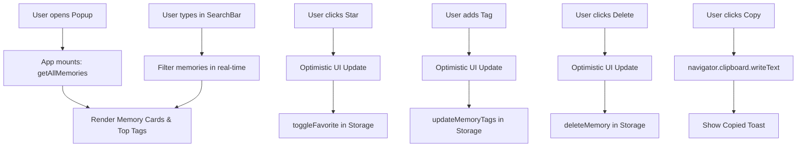

# 📋 Implementation Plan: Part 3 — The Interface (Search & Organization)

## 🎯 Objective
Build a sleek, high-performance, and responsive React Popup interface for **Context Vault** (Chrome Extension Manifest V3) constrained within standard popup dimensions (`~400px` width × `~600px` height) styled with Tailwind CSS and fully wired to the local storage engine.

---

## 🏗️ Component Architecture & File Structure

```
src/popup/
├── App.tsx                  # Main Popup layout (Header, Search, Filter Tabs, Stats, List)
├── components/
│   ├── Header.tsx           # Branding, live memory count badge, export/actions
│   ├── SearchBar.tsx        # Sticky search input with instant clear and debounce/instant filter
│   ├── FilterBar.tsx        # "All", "Favorites", and dynamic tag filter pills
│   ├── MemoryCard.tsx       # Individual memory card with quote, context, tags & action buttons
│   ├── TagInput.tsx         # Inline interactive tag creation & tag deletion chip
│   └── EmptyState.tsx       # Polished empty & no-search-results states with quick tips
├── main.tsx                 # React DOM root entry
├── index.css                # Tailwind directives, custom scrollbars, glassmorphism utilities
```

---

## 🧩 Detailed Component Specifications

### 1. Main Container & State Management (`src/popup/App.tsx`)
- **State Properties**:
  - `memories: Memory[]` (all loaded memories from `getAllMemories()`)
  - `searchQuery: string` (current search text)
  - `activeFilter: 'all' | 'favorites' | string` (selected filter tab or active tag)
  - `isLoading: boolean` (initial loading state)
  - `toastMessage: string | null` (ephemeral notification for copy/favorite/delete actions)
- **Lifecycle & Optimistic Updates**:
  - On mount: loads memories via `getAllMemories()`.
  - On search: filters in real-time across `selectedText`, `pageTitle`, `surroundingContext`, and `tags`.
  - On action (favorite, delete, add tag, remove tag): updates local state immediately for instant feedback and persists to `chrome.storage.local`.

---

### 2. Memory Card Component (`src/popup/components/MemoryCard.tsx`)
- **Header**:
  - `pageTitle`: Clickable link opening `url`. **CRITICAL**: Strictly use `chrome.tabs.create({ url })` inside an `onClick` handler (with `window.open(url, '_blank')` fallback when testing in local dev) rather than a standard `<a href="..." target="_blank">` tag, ensuring 100% bulletproof link handling in Manifest V3 popups.
  - Domain badge (e.g. `wikipedia.org`, `github.com`) extracted from `url`.
  - Relative timestamp (`"2 hours ago"`, `"Yesterday"`, or formatted date).
- **Core Content**:
  - `selectedText`: prominent quote styled with gradient accent border and distinct typography.
  - `surroundingContext`: collapsible / expandable snippet with `"Show context"` toggle.
- **Interactive Action Bar**:
  - **Copy**: copies `selectedText` to clipboard with 2-second checkmark feedback.
  - **Star (Favorite)**: toggles `isFavorite` with animated gold star state.
  - **Delete**: deletes memory with confirmation toast and immediate removal.
- **Tag Management**:
  - Existing tag pills with click-to-filter and hover-to-remove.
  - Inline input button (`+ Tag`) expanding an inline input with auto-focus, submitting on `Enter` or blur.

---

### 3. Sticky Search & Filter Bar (`src/popup/components/SearchBar.tsx` & `FilterBar.tsx`)
- Fixed at the top below header with `backdrop-blur-md` and subtle border.
- Keyboard shortcut support (`Escape` to clear search).
- Quick filter tabs:
  - **All** (total count)
  - **⭐ Favorites** (starred count)
  - **🏷️ Top Tags** (most frequently used tags)

---

### 4. UI/UX & Tailwind Design System
- **Theme**: Premium Dark Slate (`bg-slate-950`, `border-slate-800`, `text-slate-100`, indigo/violet primary accents).
- **Dimensions**: Exactly `w-[400px]` with `max-h-[600px]` scroll container.
- **Micro-interactions**: Hover effects, smooth transitions (`transition-all duration-150`), custom sleek scrollbar.

---

## 🔄 Data Flow & Storage Integration



---

## 📋 Implementation Milestones

1. **Step 1**: Create modular popup components (`MemoryCard.tsx`, `SearchBar.tsx`, `FilterBar.tsx`, `EmptyState.tsx`).
2. **Step 2**: Implement the main layout in `App.tsx` with search filtering, tag management, and optimistic state handlers.
3. **Step 3**: Enhance CSS with custom scrollbars and animations.
4. **Step 4**: Run automated verification tests (`tests/test-engine.mjs`) and execute production bundle build (`npm run build`).
5. **Step 5**: Commit and push Part 3 to GitHub (`https://github.com/HaaswithSai/ContextVault`).
